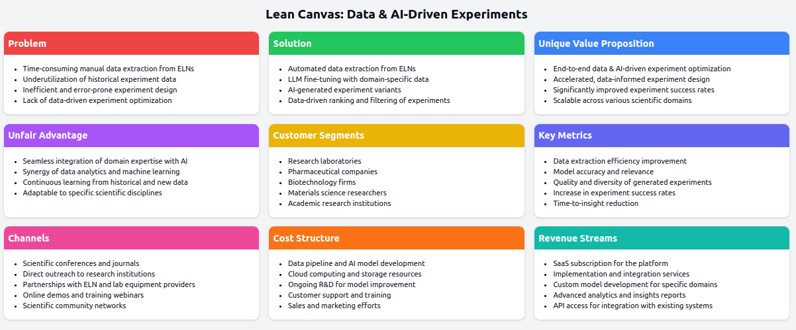
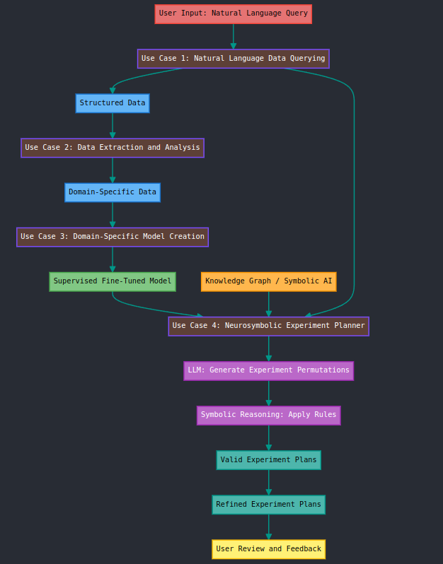

# Designing AI Architectures with Domain-Driven Design: A Use Case-Centric Approach

## 2-Hour Workshop

### Abstract

In the rapidly evolving landscape of artificial intelligence, designing architectures that effectively align with business objectives and deliver lasting value remains a critical challenge. This workshop presents a fresh perspective on tackling this challenge by leveraging the power of Domain-Driven Design (DDD) in the context of AI system development.

Through a use case-centric approach, we will explore how DDD principles can be applied to create modular, scalable, and maintainable AI architectures. We will delve into key concepts such as bounded contexts, microservices, and tactical patterns, and demonstrate their practical application in designing AI systems.

Attendees will learn how techniques like Supervised Fine-Tuning (SFT), Retrieval-Augmented Generation (RAG), and AI Agents can be seamlessly integrated into a DDD-based architecture to enhance performance and context-awareness. Real-world case studies will showcase the successful implementation of these approaches and provide valuable insights into overcoming common challenges.

Throughout the workshop, we will emphasize the importance of collaboration between domain experts, architects, and developers in creating AI systems that are closely aligned with business goals. We will also discuss future trends and opportunities in AI architecture design, inspiring attendees to push the boundaries of what is possible.

Whether you are an experienced data practitioner or just starting your AI journey, this workshop will equip you with a practical framework for designing AI architectures that deliver tangible business value. Join us as we explore the intersection of DDD and AI, and discover how this powerful combination can transform the way we build intelligent systems.

### Lean Canvas 



### Workshop Flow



### Use Cases

1. **Natural Language Data Querying**: Learn how to interface with scientific data using natural language queries.
2. **Data Extraction and Analysis**: Explore techniques for extracting structured data from unstructured sources like Electronic Lab Notebooks (ELNs).
3. **Domain-Specific Model Creation**: Create a fine-tuned model tailored to your scientific domain.
4. **Neurosymbolic Experiment Planner**: Combine neural networks and symbolic AI to generate and validate experiment plans.

### Workshop Outline (2 hours)

1. **Introduction (10 minutes)**
   - Overview of Domain-Driven Design in AI
   - Workshop objectives and use cases

2. **Use Case 1: Natural Language Data Querying (25 minutes)**
   - Introduction to NLP for scientific data
   - Hands-on: Building a simple query interface

3. **Use Case 2: Data Extraction and Analysis (25 minutes)**
   - Techniques for structuring unstructured data
   - Hands-on: Extracting data from sample ELNs

4. **Use Case 3: Domain-Specific Model Creation (25 minutes)**
   - Introduction to fine-tuning language models
   - Hands-on: Creating a domain-specific model

5. **Use Case 4: Neurosymbolic Experiment Planner (25 minutes)**
   - Combining neural networks and symbolic reasoning
   - Hands-on: Generating and validating experiment plans

6. **Conclusion and Q&A (10 minutes)**
   - Recap of key concepts
   - Discussion of potential applications
   - Q&A session

### Prerequisites

- Basic understanding of Python programming
- Familiarity with machine learning concepts (neural networks, natural language processing)
- Docker installed on your machine

### Setup Instructions

1. Clone this repository:
   ```
   git clone https://github.com/your-username/ai-ddd-workshop.git
   ```
2. Navigate to the project directory:
   ```
   cd ai-ddd-workshop
   ```
3. Each use case has its own Docker Compose file for quick setup. To run a specific use case:
   ```
   cd use-case-X-name
   docker-compose up
   ```
   Replace `X` with the use case number (1, 2, 3, or 4).

### Resources

- [Workshop Slides](link-to-slides)
- [Additional Reading on DDD and AI](link-to-reading-list)

We hope you enjoy this journey into designing AI architectures with Domain-Driven Design!
